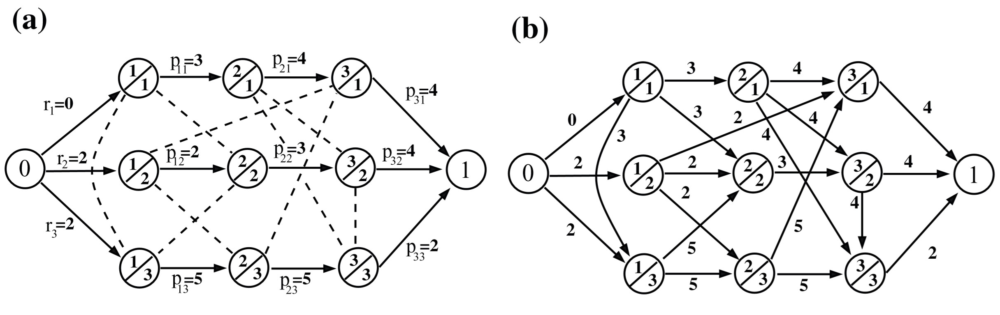

# tfm-repo

This repo features a GRASP implementation to solve the Job Shop Problem JSP. These files complement my thesis _A production scheduling service for manufacturing short-run series on machining shops_, done as part of the Master Program on Engineering Management at the [Universitat Politecnica de Catalunya UPC ESEIAAT](https://eseiaat.upc.edu/en).

A beta version of the shiny app implementing the solver is live at https://sbudelman.shinyapps.io/tfm-schedule-tool/.

Comments and suggestions are very much welcome at samueludelman@gmail.com.

# Running the code

1. Clone this repository in your machine*
2. Use the [excel spreadsheet template available](https://github.com/sbudelman/tfm-repo/blob/master/data/data1.xlsx) to upload the data of your problem.
3. Open the [main script](https://github.com/sbudelman/tfm-repo/blob/master/main.R), configure the solver (optional, default values should work reasonably good; see Grasp function's documentation [here](https://github.com/sbudelman/tfm-repo/blob/master/code/functions.R)) and run the rest of the script.

*Note that [benchmark result's folder](https://github.com/sbudelman/tfm-repo/blob/master/benchmark/results) can be quite large. You may want to pick just some of the file or dismiss it altogether.

# A glimpse of theory

## JSP formulation
On its classical form the JSP is defined by _n_ jobs and _m_ machines, where each job has as _m_ tasks, one per machine. These tasks have an associated duration and need to follow an specific sequence inside the job and machines can only perform one task at a time. The problem is to find the sequence of all tasks so that the makespan is the shortest possible[1], i.e. minimize the value of the completion time (starting plus process time) for the last task to be completed:


Another way to describe this problem is by means of the disjunctive graph formulation of JSP[2]. When defining a directed graph, each node represents a task and the arcs going from one node to another play the role of precedence constraints and have a weight equal to the process time of the task they come from. Two additional nodes are added at the beginning and the end of the graph to serve as source and sink node respectively. 

In the figure below, horizontal arcs connect tasks within a job defining the job sequency while the other arcs connecting tasks sharing the same machine would eventually represent the machine sequency. Note that while the job sequency is fixed (conjunctive constraints), the machine sequency varies from one solution to another, and this is achieved by flipping the direction of the machine arcs (disjunctive constraints). For a solution to be feasible, these machine arcs directions must be selected so the directed graph ends up being acyclic. On this setup the makespan is given by the weighted longest path from source to sink.


_Disjunctive graph example for JSP [2]_

Furthermore, the use of a disjuntive graph representation of the JSP is particularly convenient when defining neighborhoods during the local search, explained later on, and also because it often provides a more intuitive visualization of the solutions. Besides, it allows the application of graph theory procedures such as topological sorting and the assesment of longest path between two nodes, essential for defining the solver heuristics.

## The JSPTWT
Another variant also addressed in this implementation consists on assigning due dates and relative weights (priorities) to each job and minimize instead the total weighted tardiness TWT[2]. The TWT is computed as the sum of the product of weights and the difference between the due date and completion date of each job.


The JSPTWT can also be formulated with a disjunctive graph, this time replacing the sink node in the JSP formualtion with a completion node for each job and then a tardiness node after it. The weight of the arc connecting the completion nodes with their respective tardiness node is going to be equal to the due date times minus one. Note that the source node is also connected to the tardiness of each job, hence the tardiness of each job is given by the longest path from source to tardiness node:


_Disjunctive graph example for JSP [2]_

## GRASP 
GRASP stands for Greedy Randomized Adaptive Search Procedures and it is a metaheuristics that has been proved to be proficient at solving the JSP and some of its variants [3]. The following pseudo-code outlines it:

```
procedure GRASP(data, maxIterations, seed)
  ReadData(data)
  while (iterations < maxIterations)
    solution <- GreedyRandomizedConstruction(seed)
    solution <- LocalSearch(solution, maxIterations)
    updateBest <- ReturnMinObjective(solution, bestSolution)
    iterations <- iterations + 1
  return bestSolution
end
```

In the construction, a feasible solution is generated to initiate GRASP's iteration. The schedule is formed by adding one task at a time, selecting it from a restricted candidate list RCL either at random or by using a dispatch rule:

```
procedure GreedyRandomizedConstruction(seed)
  solution <- Ø
  while (number of tasks in solution < total number of tasks)
    Build a Restricted Candidate List with schedulable tasks
    Select a task to schedule based on a dispatch rule
    Update solution
  return solution 
end
```
After a solution is built, a local search is performed to explore the neighborhood of it looking for a local minimum. On this implementation a first descent algorithm is performed by taking the first improving solution from the neighborhood and starting a new local search over this one. The process continues until no better solutions are found (reaching a local minimum) or a number of iterations is reached.

```
procedure LocalSearch(solution, maxIterations)
  bestSolution <- solution
  while (iterations < maxIterations)
    Compute a neighborhood N for the solution
    if N has no neighbors break
    for neighbor in N
      newSolution <- UpdateSolution(bestSolution, neighbor)
      if newsolution is better than best
        bestSolution <- newSolution
        break for loop
    iterations <- iterations + 1
  return bestSolution 
end
```
For more information regarding how the neighborhood is calculated and the logic behind the GRASP implementation refer to [functions file](./code/functions.R).

# License

Copyright (c) 2019 Samuel Udelman

Permission is hereby granted, free of charge, to any person obtaining a copy
of this software and associated documentation files (the "Software"), to deal
in the Software without restriction, including without limitation the rights
to use, copy, modify, merge, publish, distribute, sublicense, and/or sell
copies of the Software, and to permit persons to whom the Software is
furnished to do so, subject to the following conditions:

The above copyright notice and this permission notice shall be included in all
copies or substantial portions of the Software.

THE SOFTWARE IS PROVIDED "AS IS", WITHOUT WARRANTY OF ANY KIND, EXPRESS OR
IMPLIED, INCLUDING BUT NOT LIMITED TO THE WARRANTIES OF MERCHANTABILITY,
FITNESS FOR A PARTICULAR PURPOSE AND NONINFRINGEMENT. IN NO EVENT SHALL THE
AUTHORS OR COPYRIGHT HOLDERS BE LIABLE FOR ANY CLAIM, DAMAGES OR OTHER
LIABILITY, WHETHER IN AN ACTION OF CONTRACT, TORT OR OTHERWISE, ARISING FROM,
OUT OF OR IN CONNECTION WITH THE SOFTWARE OR THE USE OR OTHER DEALINGS IN THE
SOFTWARE.

# References

- [1] Pinedo, M. L. (2009). Planning and Scheduling in Manufacturing and Services (2nd ed.). Springer.
- [2] Kuhpfahl, J. (2015). Job Shop Scheduling with Consideration of Due Dates (1st ed.). Halle: Gabler Verlag. https://doi.org/10.1007/978-3-658-10292-0
- [3] Resende M.G.C., Ribeiro C.C. (2003) Greedy Randomized Adaptive Search Procedures. In: Glover F., Kochenberger G.A. (eds) Handbook of Metaheuristics. International Series in Operations Research & Management Science, vol 57. Springer, Boston, MA
